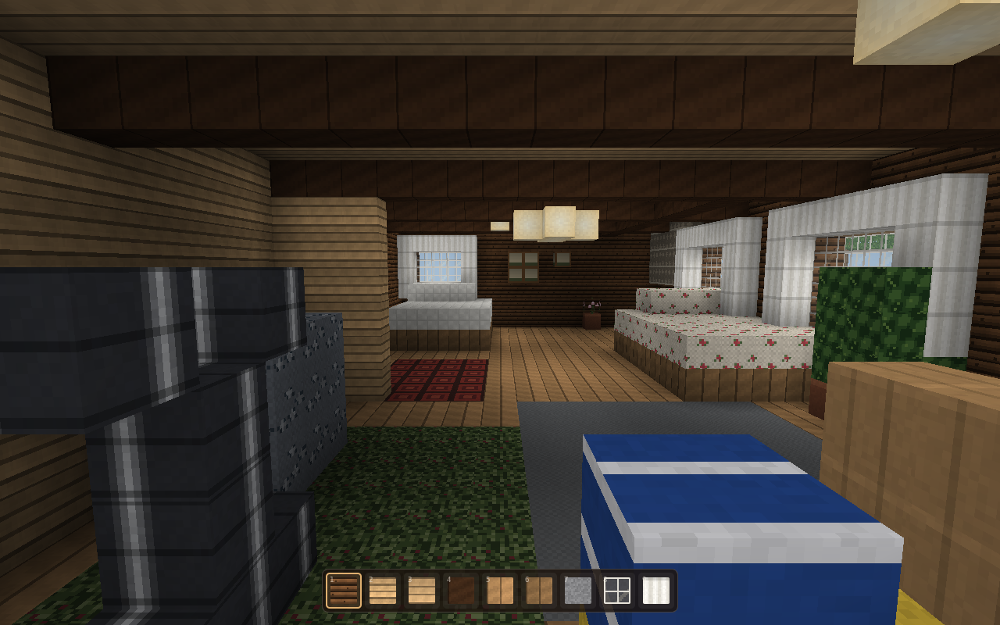
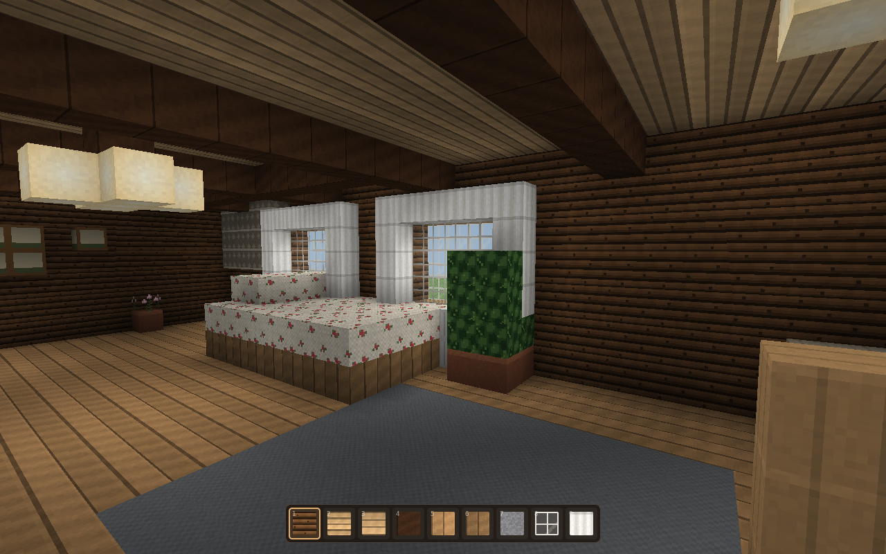
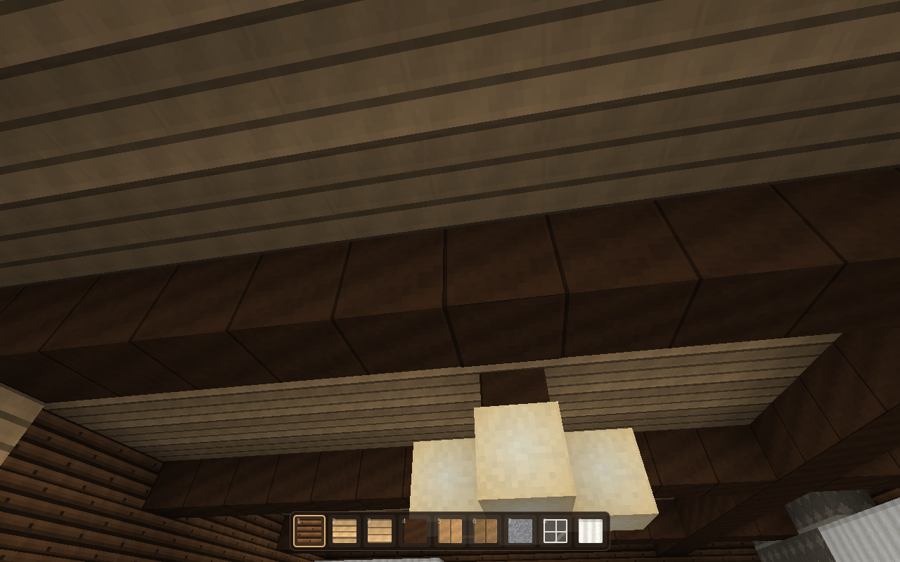
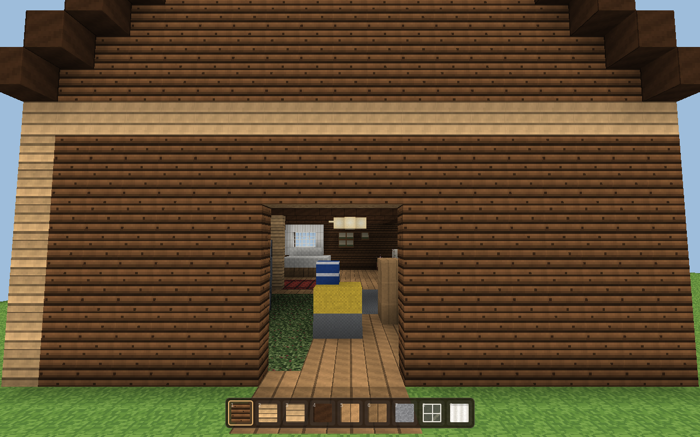

# CabinCraft

A small Minecraft-style voxel game that takes place inside **one real room** — a
log cabin living room, rebuilt block by block from a photograph: pine log walls,
a boarded ceiling on dark beams, wide floorboards, lace curtains at the windows,
a chandelier, a black upright piano, two beds, a shaggy green rug and a beige
sofa at the near end.

Walk around it, break it, rebuild it. Everything you see is placeable.



## Play

Requires Node 22+. No build step, no dependencies to run.

```
npm run dev        # then open http://localhost:3000
```

| Control | Action |
|---|---|
| `W` `A` `S` `D` | walk |
| `Space` | jump (fly up when flying) |
| `Shift` | crouch (fly down when flying) |
| `Ctrl` | sprint |
| Left click | break the block you are looking at |
| Right click | place the held block |
| Middle click / `Q` | copy the block you are looking at |
| `1`–`9`, scroll | choose a hotbar slot |
| `E` | open the block list |
| `F` | toggle flying |
| `H` | hide the HUD |
| `R` | restore the room to how it was |
| `Esc` | release the mouse |

Your changes are saved in the browser automatically, as a list of edits, and
reapplied on top of the freshly generated room next time you load the page.

## The room



One voxel is about 0.4 m, so the room is roughly 6.8 m × 12.4 m with a 2.8 m
ceiling and the player stands 1.76 m tall. You spawn at the near end looking
down the length of the room, standing where the camera stood.

* **left** — pine-panelled wall, the black piano with peonies on the lid, the
  floral armchair, the exercise bike, the long green shag rug
* **right** — log wall with two curtained windows and radiators beneath them,
  the floral bed, the house plant, the beige sofa, the wall hanging
* **far end** — the small window over the white bed, framed pictures on the logs
* **behind you** — a door out onto the meadow, with the cabin's log gable and
  roof visible from outside



## How it works

Everything is written from scratch in plain ES modules — no engine, no
rendering library, no texture files.

| File | What it does |
|---|---|
| `src/textures.js` | Draws every 16×16 texture procedurally into one atlas: log courses with knots, board seams, floral prints, shag tufts, lace folds |
| `src/blocks.js` | The block registry — which tiles go on which face, and what is solid, opaque, translucent or a light source |
| `src/world.js` | Voxel storage, flood-fill lighting for daylight and lamps, DDA ray casting, save/restore of player edits |
| `src/room.js` | The world generator: the cabin, its furniture, and the meadow and trees around it |
| `src/mesher.js` | Turns a chunk into geometry — hidden faces dropped, per-vertex ambient occlusion, smooth light sampling |
| `src/renderer.js` | WebGL2: one vertex array per chunk, a solid pass and a blended pass for glass, plus the block outline |
| `src/player.js` | AABB physics swept against the grid: gravity, jumping, crouching, flying |
| `src/main.js` | Input, hotbar, block picker, HUD and the frame loop |

Daylight is a flood fill from the open sky that leaks in sideways through the
window glass and fades as it crosses the room, so the far end is dim and the
chandelier does real work. Editing a block relights the world and rebuilds only
the chunks whose geometry or light actually changed.

## Tests

```
npm test           # unit tests (node:test) + end-to-end tests (Playwright)
```

The unit tests cover voxel indexing, light propagation, ray casting, save
handling, player physics and the room layout itself — the bed really is under
the window, the doorway really is walkable. The end-to-end tests boot the game
in Chromium and check it renders a lit room, that blocks can be broken and
placed, and that edits survive a reload.

```
node scripts/shoot.mjs [dir]   # render the viewpoints in docs/screenshots
```


